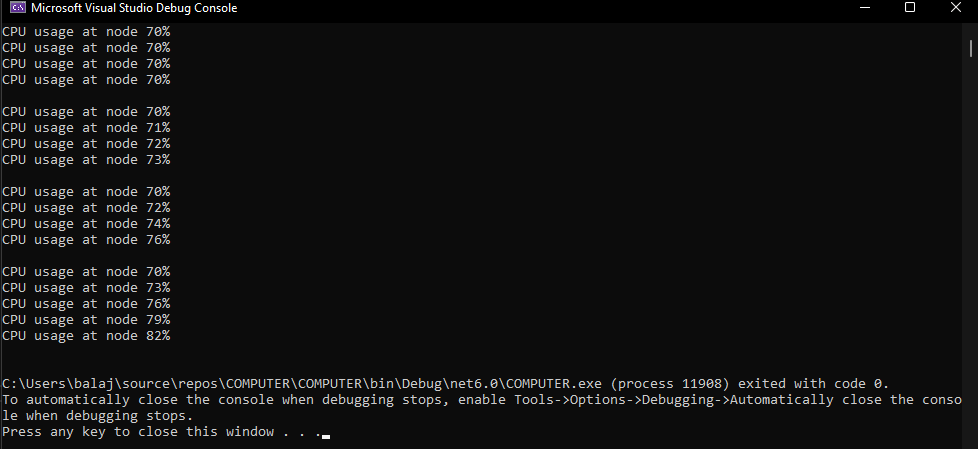

# Ex05-Rec-JaggedArray
## Aim:
To write a C# program to create a sample CPU usage on a network with 4 nodes using a jagged array.
## Algorithm:
### Step1:
Start.
### Step2:
Create a jagged array.
### Step3:
Initialize the array values
### Step4:
Using nested forloop access the elements.
### Step5:
Run the program and execute it.
### Step6:
Stop.

## Program:
```
##PROGRAM DEVELOPED BY : K.BALAJI
REGISTER NUMBER : 212221230011
```
```
using System;
class cpuactivity
{
    public static void Main(string[] args)
    {
        int[][] array = new int[4][];
        array[0]= new int[4];
        array[1]= new int[4];
        array[2]= new int[4];
        array[3]= new int[5];

        for(int i=0;i<4;i++)
        {
            for(int j=0;j<array[i].Length;j++)
            {
                array[i][j] = i * j + 70;
            }
        }
        for(int i=0;i<array.Length;i++)
        {
            for(int j = 0; j < array[i].Length;j++)
            {
                Console.WriteLine("CPU usage at node {0}{1}",array[i][j],"%");
            }
            Console.WriteLine();
        }
    }
}
```

## Output:


## Result:
Thus a C# program to create a sample CPU usage on a networkwith 4 nodes using a jagged array.
